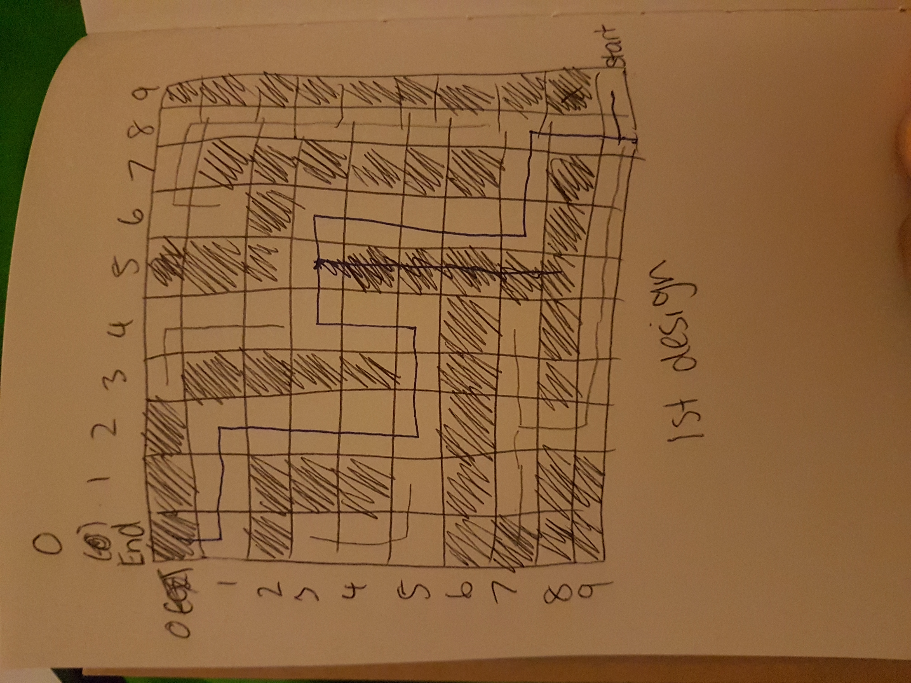
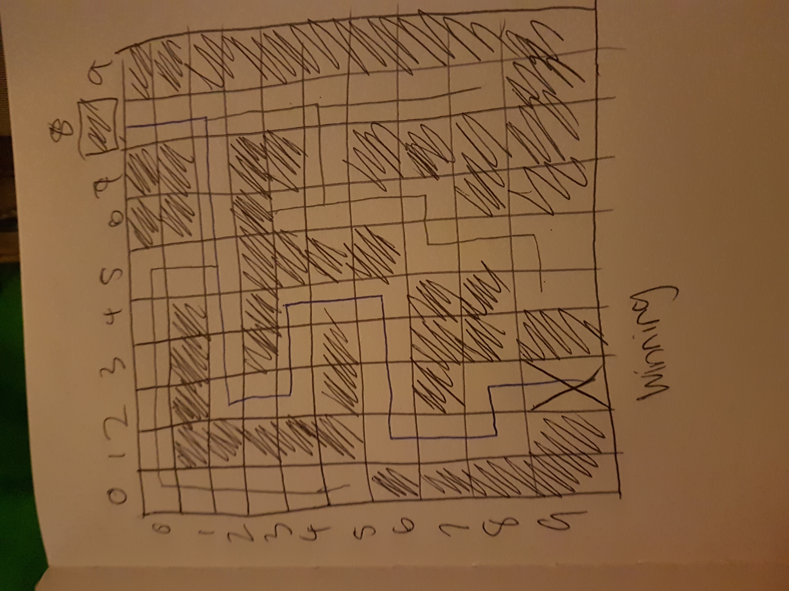

# Project 1: Maze Game


## About the game:
My team and I have come up with an idea of creating a simple interactive
terminal app game by using Ruby language. You can always use the code to create Pac-man. 

# Installation: 
To run the program you will require 2 different gems; paint and terminal-table

* Paint gem
```sh
gem install paint
```
If you get an error message, trying putting 'sudo' at the front. 

* Terminal Table
```sh
gem install terminal-table
```

# Design
Below are photos of our map designs

Map 1 :


Map 2: 


Map 3:


